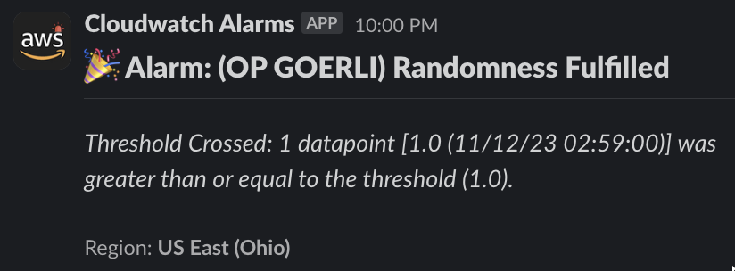

# Randcast Alarms Terraform IAC

Terraform to deploy Randcast AWS Metrics and Alarms infrastructure. 


## Usage

```bash
# deploy us-east-1 resources
cd us-east-1/terraform
terraform plan
terraform apply

# deploy us-east-2 resources
cd us-east-2/terraform
terraform plan
terraform apply

# General
cd terraform
terraform init # download provider plugins to intereact with aws
terraform validate # validate
terraform plan # view the state changes that will occur
terraform apply # provision the resources
terraform destroy # kill previously provisioned resources 
```

## Folder structure
```bash
(within us-east-1 or us-east-2)
.
└── terraform/
    ├── cloudwatch.tf
    ├── lambda-s3-bucket.tf
    ├── lambda.tf
    ├── provider.tf
    ├── sns-topic.tf
    └── variables.tf
└── functions/
    └── send-cloudwatch-alarms-to-slack/
        └── function.py
```

## Slack Alarm Example


## Networked where Alerts are currently suppported 
- [x] Eth Mainnet (1)
- [x] OP Mainnet (10)
- [x] Base Mainnet (8453)
- [x] Eth Goerli (5)  
- [x] OP Goerli (420)
- [x] Base Goerli (84531)
- [x] Eth Sepolia (11155111)
- [x] OP Sepolia (11155420) <- (randcast not yet implemented)
- [x] Base Sepolia (84532) <- (randcast not yet implemented)

## Metric Filters Implemented 

### Region: us-east-2
#### Log Group: test-goerli-node-client-logs 
- Eth Goerli: "Transaction successful(fulfill_randomness) with chain_id(5)"
- OP Goerli: "Transaction successful(fulfill_randomness) with chain_id(420)"
- Base Goerli: "Transaction successful(fulfill_randomness) with chain_id(84531)"

### us-east-1
#### Log Group: test-sepolia-node-client-logs
- Eth Sepolia: "Transaction successful(fulfill_randomness) with chain_id(11155111)"
- OP Sepolia: "Transaction successful(fulfill_randomness) with chain_id(11155420)"
- Base Sepolia: "Transaction successful(fulfill_randomness) with chain_id(84532)"

#### Log Group: prod-mainnet-node-client-logs
- Eth Mainnet: "Transaction successful(fulfill_randomness) with chain_id(1)"
- OP Mainnet: "Transaction successful(fulfill_randomness) with chain_id(10)"
- Base Mainnet: "Transaction successful(fulfill_randomness) with chain_id(8453)"

## Differences between us-east-1 and us-east-2 folder

- terraform/variables.tf: region set here to match folder. This region is used to name global variables:
  - IAM Role: sns-logs-${var.region} 
  - IAM Role: send-cloudwatch-alarms-to-slack-${var.region} 
  - Lambda S3: lambda-${var.region}-pet-name

- terraform/cloudwatch.tf: metric filters and alarms set to match regional log groups. 


## Rolldice contract locations (for testing)
- eth goerli: 0xCA7990A5639560Df0e20aEAD45AD2c0990768a64 (sub #8)
- op goerli: 0x278c8a42b3506724153625e7e233BD5940042F0F (sub #87)
- eth sepolia: 0x98dB27BCa7193dae03dBaA67d16B90B49F2C6722 (sub #112)

## Slack Alarms Secret Manual Proccess
Note: The slack_url webhook secret was manually added to SSM Parameter Store encrypted. 

```python
# functions/send-cloudwatch-alarms-to-slack/function.py
ssm = boto3.client("ssm")
parameter = ssm.get_parameter(Name="slack_url", WithDecryption=True)
slack_url = parameter["Parameter"]["Value"]
```