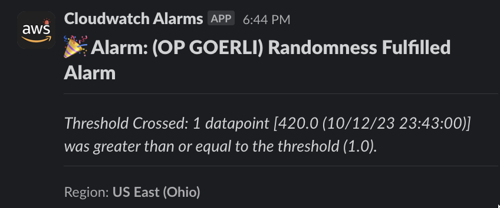

# Randcast Alarms Terraform IAC

Terraform to deploy Randcast AWS Metrics and Alarms infrastructure. 


## Usage
```bash
cd tf
terraform init # download provider plugin to interact with docker
terraform validate # validate
terraform plan # view the state changes that will occur
terraform apply # provision the resources
terraform destroy # kill previously provisioned resources 
```

## Folder structure
```bash
.
└── tf/
    ├── cloudwatch.tf
    ├── lambda-s3-bucket.tf
    ├── lambda.tf
    ├── provider.tf
    ├── sns-topic.tf
    ├── terraform.tfstate
    └── terraform.tfstate.backup
└── functions/
    └── send-cloudwatch-alarms-to-slack/
        └── function.py
```

## Slack Alarm Example


## Planned networks to alert on
- [ ] Eth (1)
- [ ] OP (10)
- [ ] Base (8453)
- [x] Eth Goerli (5)  
- [x] OP Goerli (420)
- [x] Base Goerli (84531)
- [ ] Eth Sepolia (11155111)
- [ ] OP Sepolia (11155420)
- [ ] Base Sepolia (84532)

## Alarms Currently Implemented
(us-east-2)

Eth Goerli: "Transaction successful(fulfill_randomness) with chain_id(5)"

OP Goerli: "Transaction successful(fulfill_randomness) with chain_id(420)"

Base Goerli: "Transaction successful(fulfill_randomness) with chain_id(84531)"


